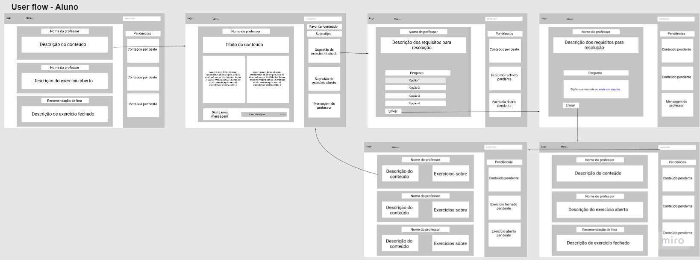
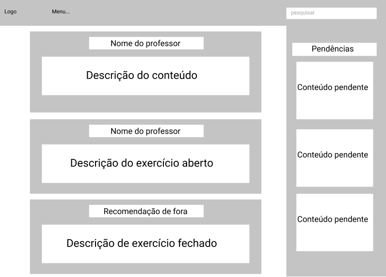
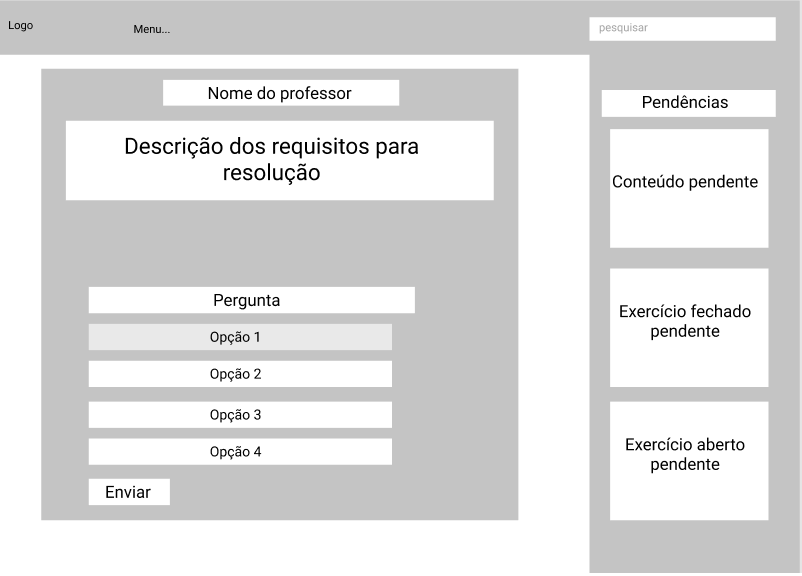
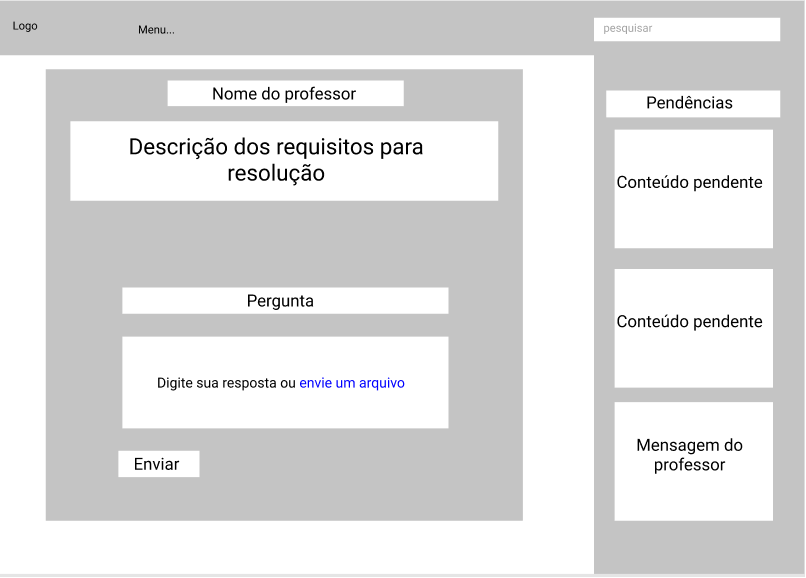
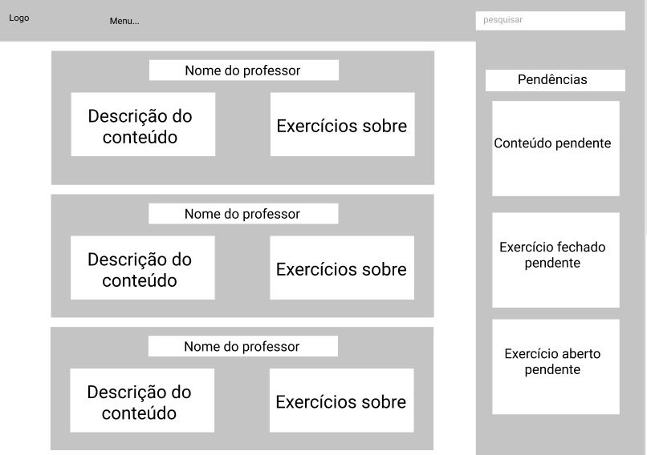
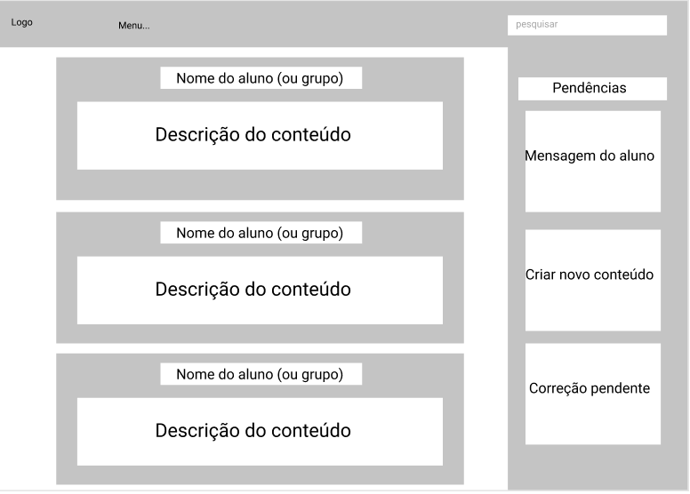
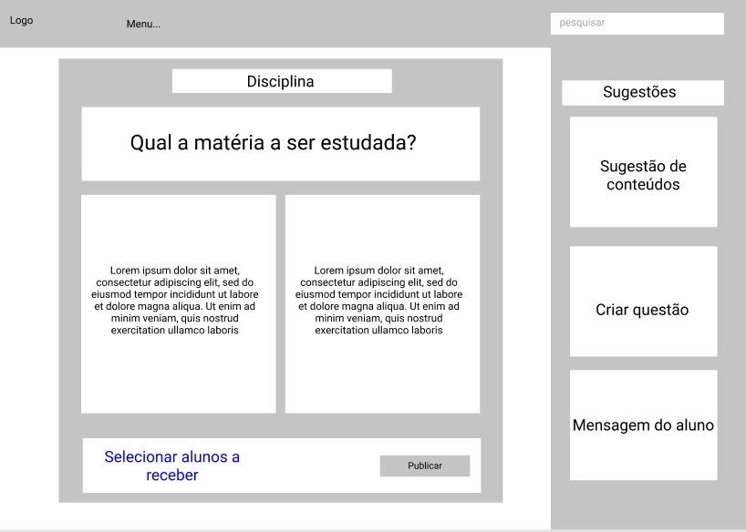

# Projeto de Interface

Pré-requisitos: <a href="2-Especificação.md"> Documentação de Especificação</a>

> Apresente as principais a interface da plataforma. Discuta como ela
> foi elaborada de forma a atender os requisitos funcionais, não
> funcionais e histórias de usuário abordados nas [Especificações do
> Projeto](2-Especificação.md).

## User Flow

## Wireframes
> **Comece a simulação partir do flow1 para o início na visão do aluno e, para o professor, pelo flow6**
> - [Wireframe/protótipo em Figma](https://www.figma.com/file/L89OVGDIpEiy2j9DCtDdIu/Wireframes-PCD?node-id=0%3A1)
> - Tela inicial - aluno
> - 
> - Tela conteúdo
> - 
> - Tela exercício fechado
> - 
> - Tela exercício aberto
> - 
> - Tela conteúdo público
> - 
> - Tela inicial - professor
> - 
> - Tela criar conteúdo
> - 
