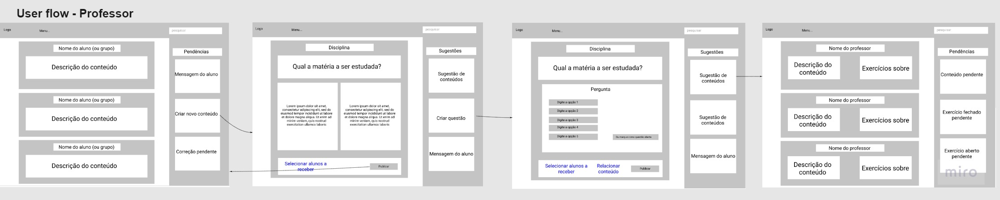
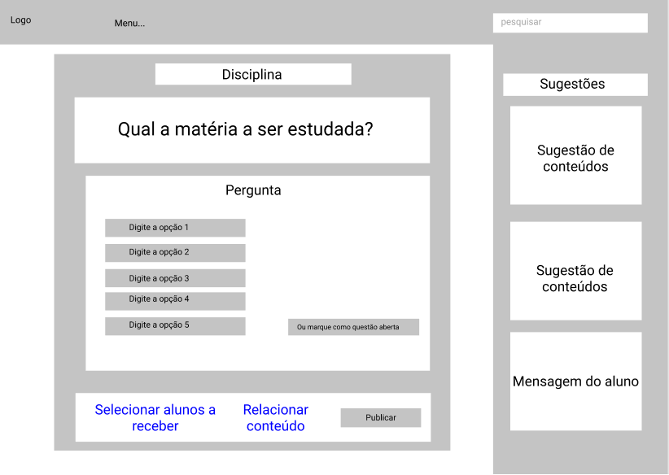

# Projeto de Interface

Pré-requisitos: <a href="2-Especificação.md"> Documentação de Especificação</a>

* Com os resultados das entrevistas com stakeholders,identificamos algumas necessidades que o projeto de solução deveria ter,como:

1. Uma interface simples,que não contenha muitos itens,numa mesma tela;
2. Uso de poucas cores,de preferência de tom forte.
## User Flow

## Wireframes
> **Comece a simulação partir do flow1 para o início na visão do aluno e, para o professor, pelo flow6**
> - [Wireframe/protótipo em Figma](https://www.figma.com/file/L89OVGDIpEiy2j9DCtDdIu/Wireframes-PCD?node-id=0%3A1)
> - Tela inicial - aluno
> - 
> - Tela conteúdo
> - 
> - Tela exercício fechado
> - 
> - Tela exercício aberto
> - 
> - Tela conteúdo público
> - 
> - Tela inicial - professor
> - 
> - Tela criar conteúdo
> - 
> - Tela criar questão
> - 
