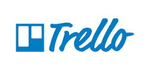

# Gerenciamento de Projeto

### Sprint 0

O metódo "brainstorm" foi utilizado nas sessões iniciais de idealização do projeto,
ou seja todos do grupo davam palpites sobre o que deveria ser feito e como,e as ideias
que mais pareciam ser eficientes/possíveis para o problema em questão e para nosso
nível de habilidade,de acordo com a opinião de todos os integrantes do grupo,eram acatadas.

## Divisão de Papéis

### Sprint 0

Apesar de não haver divisão clara de papéis nessa sprint em especifíco,o que foi 
observado na prática é que o integrante Arthur agiu como o líder do projeto,pela sua 
experiência anterior em outro projeto sobre o mesmo assunto,e capacidade maior de tomar a 
iniciativa nas reuniões do grupo.

> Apresente a divisão de papéis entre os membros do grupo.
>
> **Links Úteis**:
> - [11 Passos Essenciais para Implantar Scrum no seu 
> Projeto](https://mindmaster.com.br/scrum-11-passos/)
> - [Scrum em 9 minutos](https://www.youtube.com/watch?v=XfvQWnRgxG0)

## Processo

> Coloque  informações sobre detalhes da implementação do Scrum seguido
> pelo grupo. O grupo poderá fazer uso de ferramentas on-line para acompanhar
> o andamento do projeto, a execução das tarefas e o status de desenvolvimento
> da solução.
> 
> **Links Úteis**:
> - [Tutorial Trello](https://trello.com/b/8AygzjUA/tutorial-trello)
> - [Gestão ágil de projetos com o Trello](https://www.youtube.com/watch?v=1o9BOMAKBRE)
> - [Gerência de projetos - Trello com Scrum](https://www.youtube.com/watch?v=DHLA8X_ujwo)
> - [Tutorial Slack](https://slack.com/intl/en-br/)

## Ferramentas

As ferramentas empregadas no projeto são:

- Editor de código - Visual Studio Code
- Ferramentas de comunicação - Whatsapp
- Ferramentas de diagramação - Figma,Miro
- Ferramentas de gerenciamento - Github(Quadro de projetos)

O editor de código foi escolhido porque era o que já era utilizado pelos
integrantes do grupo,e por ter contas de estudante distribuídas pela PUC MINAS. 
As ferramentas de comunicação utilizadas também já eram de uso comum do grupo.
Para criar diagramas utilizamos essa ferramenta por serem as recomendadas
oficialmente pelo professor da disciplina para o projeto aqui apresentado.
Por fim,uma ferramenta no site que guarda o repositório do projeto foi utilizada 
para melhor gerenciar o trabalho feito,para evitar o uso de mais alguma plataforma 
extra,como o Trello.

> Liste quais ferramentas foram empregadas no desenvolvimento do
> projeto, justificando a escolha delas, sempre que possível.
> 
> **Possíveis Ferramentas que auxiliarão no gerenciamento**: 
> - 
> - 
> 
> - 
> - 